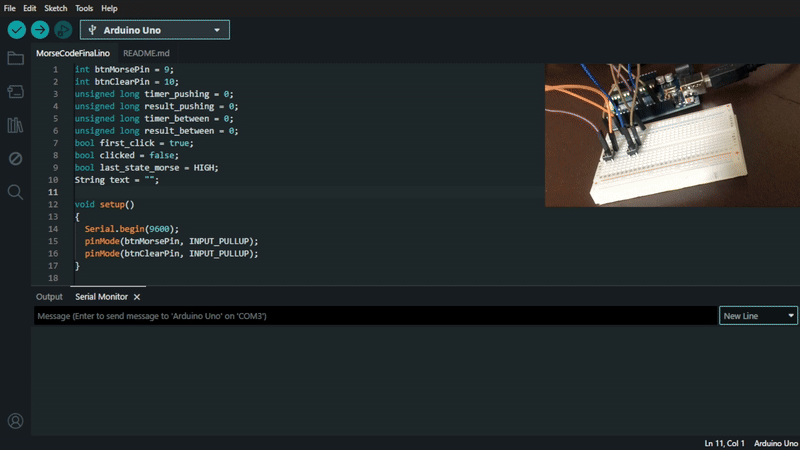
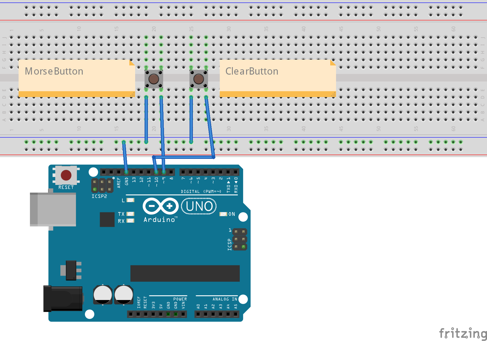
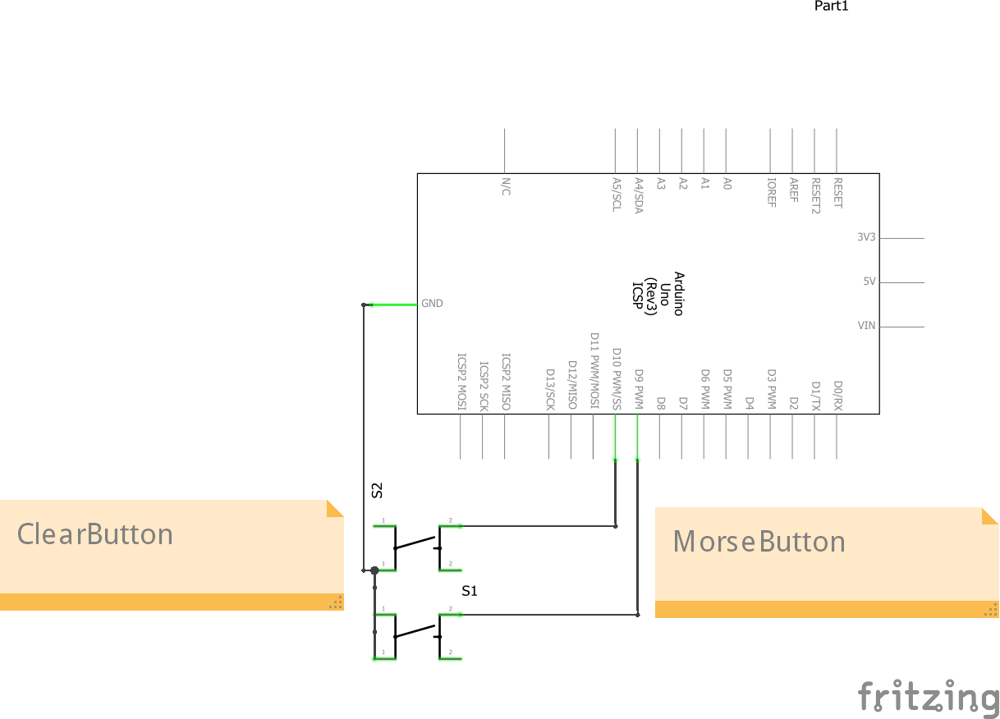

# Morse Code Reader with Arduino

This project is a simple Morse code reader made with Arduino using only two push buttons:
- One for inputting the code (`.` or `-`)
- Another to clear/reset the current sequence

The duration of each press determines if it is a dot (`.`) or a dash (`-`), and the pause between presses determines spaces (` `) and slashes (`/`) for new words.

---

## 📸 Demo Preview



---

## 🧠 Features

- Press duration logic to detect dot or dash
- Time between presses defines letters or words
- Real-time display of the full Morse sequence in the Serial Monitor
- Reset button clears everything

---

## 🧰 Components Used

- Arduino UNO
- 2x Push buttons
- Breadboard & jumper wires

---

## 📷 Breadboard View



---

## 🗺️ Schematic View



---

## 💻 Code

```cpp
int btnMorsePin = 9;
int btnClearPin = 10;
unsigned long timer_pushing = 0;
unsigned long result_pushing = 0;
unsigned long timer_between = 0;
unsigned long result_between = 0;
bool first_click = true;
bool clicked = false;
bool last_state_morse = HIGH;
String text = "";

void setup()
{
  Serial.begin(9600);
  pinMode(btnMorsePin, INPUT_PULLUP);
  pinMode(btnClearPin, INPUT_PULLUP);
}

void loop() {
  bool current_state_morse = digitalRead(btnMorsePin);
  bool current_state_clear = digitalRead(btnClearPin);

  if (current_state_morse == LOW && last_state_morse == HIGH && !clicked) {
    if (timer_between == 0) {
      timer_between = millis();
    } else {
      result_between = millis() - timer_between;
    }
    timer_pushing = millis();
    clicked = true;
  }
  else if (current_state_morse == HIGH && clicked) {
    result_pushing = millis() - timer_pushing;
    if (result_between > 3200) {
      text += " / ";
    } else if (result_between > 1500) {
      text += " ";
    }
    if (result_pushing >= 250) {
      text += "-";
    } else if (result_pushing < 250) {
      text += ".";
    } else {
      Serial.println("Error!");
    }
    Serial.println(text);
    timer_between = millis();
    clicked = false;
  }

  if (current_state_clear == LOW) {
    Serial.println("\nCleaned!\n");
    timer_pushing = 0;
    result_pushing = 0;
    timer_between = 0;
    result_between = 0;
    first_click = true;
    clicked = false;
    last_state_morse = HIGH;
    text = "";
    delay(300);
  }

  last_state_morse = current_state_morse;
}

```
---

## 📜 License

MIT License – feel free to use, modify, and share. Credit is appreciated!

---

Fully written by **Mateus Vega (15y 🇧🇷)**
